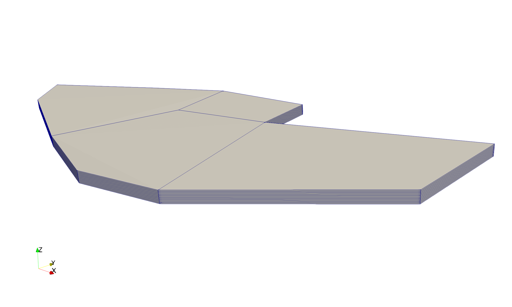
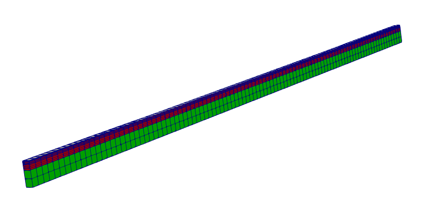

# Building Exodus

A Makefile is provided to ease to process of building Exodus. Just run:

    make exodus

and it will be downloaded to `./seacas/` and built. You will need CMake 3.10+,
gcc and g++.

---

It may take up to 45 minutes for Exodus to compile, depending on 
network speeds and machine specs.

# Configuring the Python examples

Python scripts are included in the `py-lib` directory. These are used to create
3D Exodus meshes.

These scripts were written by Ethan Coon as part of the Amanzi/ATS project and can 
originally be found [here](https://github.com/amanzi/ats/tree/master/tools/meshing_ats/meshing_ats).

## Configuring `python-exodus`

This script uses the Exodus Python library to make calls to the compiled
C library. 

To get Python to find the `exodus-python` package, either append the SEACAS 
library path to your `PYTHONPATH`:

```bash
export PYTHONPATH=$PYTHONPATH:$(pwd)/seacas/lib
```

Or set the `SEACAS_DIR` environment variable:

```bash
export SEACAS_DIR=$(pwd)/seacas
```

**Also,** export the environment variable `ACCESS`, which Exodus uses
internally:

```bash
export ACCESS=$(pwd)/seacas
```

# Running the Python examples

Reference meshes for the two examples can be found in the `output/` directory.

## Four Polygon Test



```bash
cd four-polygon-test
python2.7 ../py-lib/meshing_ats.py -n 10 -d 1 ./four_polygon.vtk
```
This will read in the 2D mesh `four_polygon.vtk` and extrude and write to
`four_polygon.exo`.

## Basic Example



```bash
cd py-lib
python2.7 basic_ats_example.py
```

This will use Numpy to generate a simple mesh in `output/meshing_ats_example.exo`.

# Visualizing Exodus files

ParaView or VisIT can be used to view the Exodus fils.
